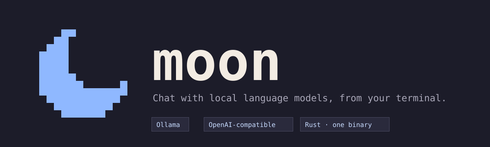
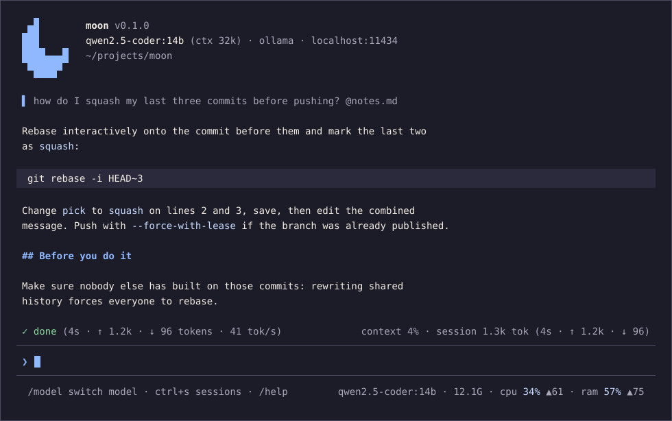

<p align="center">
  
</p>

<p align="center">
  <a href="#installation"></a>
  <a href="LICENSE"></a>
  
  
</p>

<p align="center">
  A fast, keyboard-first chat client for language models that run on your own machine.<br>
  Ollama out of the box, any OpenAI-compatible server next to it, and the state of your hardware always in view.
</p>

<p align="center">
  
</p>

## Features

- **Local first.** Talks to Ollama over its native API, so it knows what only Ollama can tell: context windows, quantization, which model is in memory and how much it takes. Any OpenAI-compatible server (LM Studio, llama.cpp, vLLM, OpenRouter…) plugs in with three lines of configuration.
- **A real chat interface.** Streaming Markdown with syntax-highlighted code, a status line that shows what the model is doing, tokens sent and received, speed, and how much of the context window the conversation fills.
- **Your files in the context.** Attach a file or a line range with `@path`, keep files attached for the whole conversation from the files panel (`Ctrl+F`), and put a `MOON.md` in a project so the model knows what it is looking at.
- **A model that acts, on your terms.** In `/tools` the model can be let read and edit files and run commands from a fixed list — `git diff`, `cargo check`, `curl`… — each one `off`, `ask` or `allow`. Never through a shell, never above the directory you started in, and edits are a diff you apply unless you say otherwise.
- **Sessions that survive.** Every conversation is saved as JSONL. Resume the last one, pick any from a list, rename, delete, export to Markdown.
- **Switch models mid-conversation.** A fuzzy list grouped by provider, with your recent models on top. The history stays; the next question goes to the new model.
- **The machine, always in view.** CPU, RAM and GPU memory in the corner, with the peak of the last three minutes, and the loaded model's footprint next to it. When a model spills to the CPU or to swap, you see it before you feel it.
- **Scriptable.** `moon ask` streams a reply to stdout, reads the prompt from a pipe, and keeps everything else on stderr.
- **Fast, small, private.** One Rust binary. No telemetry, no network traffic except to the providers you configure: `moon update` goes to GitHub when you run it, and the start-up check stays off until you turn it on.

## Installation

moon is one binary with nothing else to install. It runs on macOS, Linux and Windows; the Windows build is recent and has had less testing, so use Windows Terminal or another terminal with ANSI support, and open an issue if something misbehaves.

**Linux / macOS**

```sh
curl -fsSL https://raw.githubusercontent.com/towerforge/moon/main/install.sh | sh
```

Detects your OS and architecture, verifies the SHA-256 and installs to `/usr/local/bin` as root, otherwise to `~/.local/bin`. `MOON_INSTALL_DIR`, `MOON_VERSION`, `MOON_VARIANT=musl|gnu` and `MOON_FORCE=1` change where, which version, which Linux binary and whether to install over an existing one.

**Windows**

```powershell
irm https://raw.githubusercontent.com/towerforge/moon/main/install.ps1 | iex
```

Installs `moon.exe` to `%LOCALAPPDATA%\Programs\moon`, verifies its SHA-256 and adds it to your user `PATH`. The same `MOON_INSTALL_DIR`, `MOON_VERSION` and `MOON_FORCE` apply, as `$env:` variables.

**Manual download.** Binaries are on the [releases page](https://github.com/towerforge/moon/releases/latest), with `checksums.txt` next to them:

| Platform | Asset |
|---|---|
| Linux x86_64 · ARM64 (glibc) | `moon-linux-x86_64.tar.gz` · `moon-linux-aarch64.tar.gz` |
| Linux x86_64 · ARM64 (static) | `moon-linux-x86_64-musl.tar.gz` · `moon-linux-aarch64-musl.tar.gz` |
| macOS Intel · Apple Silicon | `moon-macos-x86_64.tar.gz` · `moon-macos-aarch64.tar.gz` |
| Windows x86_64 | `moon-windows-x86_64.zip` |

**From source** (Rust 1.88 or newer): `cargo install --git https://github.com/towerforge/moon moon-cli`, or `make install` in a checkout.

**Updating.** The installers do the first install and step aside; from then on:

```sh
moon update          # what the new release brings, and it installs it once you say yes
moon update --check  # says what there is and installs nothing
```

It downloads the release for your platform, checks its SHA-256 and swaps the binary in place. `-y` skips the question, `--to 0.2.0` picks a version, `--force` reinstalls. It leaves a binary from `cargo install` or a local build alone, and says so; `sudo moon update` where you cannot write. With `update_check = true` moon asks GitHub once a day and says at startup when there is something newer.

## Getting started

1. Have [Ollama](https://ollama.com) running and a model pulled:

   ```sh
   ollama pull qwen2.5-coder:14b
   ```

2. Start moon. With no configuration it finds Ollama at `http://localhost:11434` (or wherever `OLLAMA_HOST` points) and picks the first model it sees:

   ```sh
   moon
   ```

3. Type a question and press `Enter`. `Esc` cancels a reply. `/model` or `Ctrl+P` switches models. `/help` lists everything else.

4. When you want to change something, write the commented configuration and edit it:

   ```sh
   moon config init     # writes ~/.config/moon/config.toml and tools.toml next to it
   ```

## Usage

From top to bottom: a header with the version, the model and the directory you started in; the conversation; a status line with what the model is doing and how much of the context window is used; the input box; and a row of hints with the model and the machine:

```
⏵⏵ Read · 2 commands   /tools files · /model switch model   qwen2.5-coder:14b · 12.1G · cpu 34% ▲61 · ram 57% ▲75
```

Every list — models, sessions, files, tools, the help — unfolds as a panel under the conversation, in the input box's place: `↑↓` move, the number of a row jumps to it, `Enter` picks, `Esc` closes. `/machine` draws the CPU, RAM and GPU readings over the last three minutes. The whole screen, row by row, is in [docs/interface.md](docs/interface.md).

### Slash commands

Type `/` and the commands that match appear over the box, drawn like the panel: a title with how many are left, `❯` on the highlighted one and a bar on the right when they do not all fit. `↑↓` move, `Tab` completes, `Enter` runs the highlighted one.

| Command | What it does |
|---|---|
| `/model` | switch model: opens the list to pick one |
| `/provider [id]` | provider status, or set the default provider |
| `/new` | new conversation |
| `/clear` | clear the view without closing the conversation |
| `/system [text]` | show or set the system prompt |
| `/params key=value …` | generation parameters: `temperature`, `num_ctx`, `top_p`, `max_tokens`, `think`, `stop` |
| `/sessions` | resume a saved conversation (also `Ctrl+S`); `Ctrl+R` renames, `Ctrl+D` deletes |
| `/save [name]` | save the conversation and, optionally, rename it |
| `/export [path.md]` | export the conversation as Markdown |
| `/copy` | copy the last reply to the clipboard |
| `/retry` | regenerate the last reply |
| `/undo` | remove the last question/reply pair |
| `/files` | attached files: see what they cost, detach them and add more (also `Ctrl+F`) |
| `/tools` | what the model may do: files and commands, each off, ask or allow — see [Letting the model act](#letting-the-model-act) |
| `/context` | what the model sees: context file, attached files, token budget, machine |
| `/machine` | cpu, ram, gpu and swap drawn over the last 3 minutes |
| `/help` | commands and keys, in a scrollable panel |
| `/quit` | quit |

### Keys

| Key | Action |
|---|---|
| `Enter` | send |
| `Ctrl+J` · `Alt+Enter` · `Shift+Enter` | newline (`Shift+Enter` only with the kitty keyboard protocol) |
| `Esc` | cancel the generation · close the panel · clear the selection |
| `Ctrl+C` | cancel; twice with an empty input, quit |
| `Ctrl+D` · `Del` | quit if the input is empty · in the sessions panel, delete the highlighted session |
| `Ctrl+R` | in the sessions panel, rename the highlighted session |
| `1`…`9` · `12` · `Alt+1`…`Alt+9` | in a list, go to the row with that number and open it; past the ninth it takes two digits, or `Enter` to settle for the row you are on; while you are typing a filter the digits belong to it, `Alt` always jumps |
| `Ctrl+P` | model panel |
| `Ctrl+S` | sessions panel |
| `↑` · `↓` · `Enter` · `s` · `Esc` | in the approval panel: choose apply (or run) or skip · confirm · skip · cancel the turn; `PgUp` · `PgDn` scroll the diff |
| `↑` · `↓` · `Enter` · `←` · `→` · `Esc` | in the tools panel: move · open a group, or on and off inside one · a whole group off or on, or `off` · `ask` · `allow` inside one, or the number · save: back out of a group, or close from the groups |
| `Ctrl+F` | files panel: what is attached, what it costs, and the tree to attach more |
| `↑` · `↓` | prompt history (on the first / last line of the input) |
| `PgUp` · `PgDn` · `Ctrl+↑` · `Ctrl+↓` | scroll the conversation |
| `Ctrl+End` · `Ctrl+Home` | jump to bottom (and follow the reply) · to top |
| `Tab` | complete a command, or a path after `@` |
| `Ctrl+W` · `Ctrl+U` · `Ctrl+K` | delete word · to line start · to line end |
| `Ctrl+A` · `Ctrl+E` | start · end of line |

The mouse works too: the wheel scrolls, dragging over the conversation selects text and copies it when you let go, and the «↓ Jump to bottom» pill is clickable. In the input box a click moves the cursor and a drag selects what you are writing — it is copied when you let go, and the next key drops the highlight without touching the text. To select text with your terminal instead, hold `Shift` while dragging, or set `mouse = false`.

### Files in the context

The model only sees what you give it: `@path` or `@path:40-120` in a message attaches a file as it is now; `Ctrl+F` keeps files attached for the whole conversation and shows what each one costs; a `MOON.md` in the directory you start from goes into every system prompt. moon warns instead of sending when the attachments would pass 80 % of the context window, and refuses binaries and files that look like credentials (`@!path` forces one through).

### Letting the model act

Off until you turn it on. `/tools` lists everything the model could do on your project, in five groups — **Editor** (moon's own reading, editing and creating of files, and how the calls run), **Files**, **Git**, **Build** and **Network** — and each thing is **off** (not offered), **ask** (shown to you first: the diff, or the command line) or **allow** (runs on its own).

```
 ❯ Editor   ▸  allow: read files, commands in subfolders · ask: edit existing files · 8 steps
   Files    ▸  allow: ls, cat
   Git      ▸  allow: git status, git diff · ask: git commit
   Build    ▸  off
   Network  ▸  off
```

`Enter` opens a group, `←`/`→` set a whole group off or to its defaults, and inside one they walk `off · ask · allow`; `Esc` saves. `Editor` also holds two settings for every call: whether a command may run in a subfolder of the project (never above it), and how many tool calls a message may take. What you set lives in `tools.toml`, next to `config.toml`, with every command listed: edit it by hand and the next message uses it, change it in the panel and the file follows.

Commands run as programs with their arguments, never through a shell, and only from a fixed list. Paths stay under the directory you started in. Edits and new files ask by default; set them to `allow` and they are written without showing you the diff. The full list, the rules and what they cannot protect you from are in [docs/tools.md](docs/tools.md).

### Sessions and the CLI

Conversations are saved as JSONL and titled after the first message. `Ctrl+S` opens them: `Enter` resumes, `Ctrl+R` renames, `Ctrl+D` deletes. `moon --resume` continues the last one.

```sh
moon ask "explain the borrow checker"          # reply streams to stdout
git diff | moon ask --system "review this"     # prompt from stdin
moon -m ollama/qwen2.5-coder:14b               # start with this model
moon models · moon providers · moon sessions list · moon config init | path | show
```

More in [docs/interface.md](docs/interface.md#the-cli).

## Configuration

Everything is optional; without a file moon talks to Ollama on `localhost` and uses the first model it finds. `moon config init` writes two commented files in `~/.config/moon/`: `config.toml` for moon itself and `tools.toml` for what the model may do.

```toml
[general]
default_model = "ollama/qwen2.5-coder:14b"
system_prompt = "Answer briefly."

[params]
num_ctx = 16384          # the window Ollama loads the model with

[providers.lmstudio]     # any OpenAI-compatible server
type     = "openai"
base_url = "http://localhost:1234/v1"
```

Every key, the providers, the theme and the log are in [docs/configuration.md](docs/configuration.md).

## FAQ

**`Shift+Enter` sends instead of inserting a newline.** Terminals only distinguish `Shift+Enter` from `Enter` with the kitty keyboard protocol (kitty, WezTerm, Ghostty, foot). Everywhere else use `Ctrl+J` or `Alt+Enter`.

**The colors look flat.** Your terminal did not announce truecolor, so moon falls back to the 256-color palette. Set `COLORTERM=truecolor` if the terminal really supports it. Terminal.app on macOS does not.

**The wheel changes my prompt instead of scrolling.** That happens with `mouse = false`: in the alternate screen the terminal turns wheel events into arrow keys. Leave mouse capture on and hold `Shift` when you want the terminal's own text selection.

**Does moon edit files or run commands?** Only what you set in `/tools`, and never through a shell. Off by default. See [Letting the model act](#letting-the-model-act).

**Where does the model size come from?** From Ollama's `/api/ps`: the loaded footprint, how much of it sits in the GPU, the context length and when it will be unloaded. Other providers do not expose this.

**Which Ollama version do I need?** Any recent one. moon is developed against 0.34.

## Development

```sh
make check              # fmt --check + clippy -D warnings + tests, what CI runs
make run ARGS="ask hi"  # run from source
make build              # release binary in target/release/moon
make help               # everything else: cross-compiling, versioning, releasing
```

A Cargo workspace of seven crates:

| Crate | Role |
|---|---|
| `moon-core` | the `Provider` trait, domain types, configuration, XDG paths, JSONL sessions, files in the context |
| `moon-provider-ollama` | Ollama over its native API |
| `moon-provider-openai` | any OpenAI-compatible chat completions API |
| `moon-agent` | the model acting on the project: the loop, the catalogue of what it may do, the tools and the sandbox; [docs/harness.md](docs/harness.md) is the design |
| `moon-tui` | the interface: `app/` is the state, Elm style, one module per concern; `view/` paints it |
| `moon-updater` | the GitHub releases, the checksum and the swap of the binary behind `moon update` |
| `moon-cli` | the `moon` binary |

Adding a provider is a new crate that implements `Provider` and `ProviderFactory`, plus one line in `crates/cli/src/main.rs`. Adding a command the model may run is one `Entry` in `crates/agent/src/tools/catalog.rs`; `UPDATE_DOCS=1 cargo test -p moon-agent docs` then refreshes its table in [docs/tools.md](docs/tools.md). Rendering is tested on ratatui's `TestBackend`, providers on `wiremock`. See [CONTRIBUTING.md](CONTRIBUTING.md) for conventions and the release flow.

## Contributing

Bug reports, provider integrations and rough edges made smooth are all welcome. Read [CONTRIBUTING.md](CONTRIBUTING.md), open a pull request against `dev`, and make sure `make check` is green.

## License

[MIT](LICENSE)

<p align="center">
  <br>
  
  <br>
  <sub>Built with the Moon design system: one brand color, a pixel crescent, square corners.</sub>
</p>
