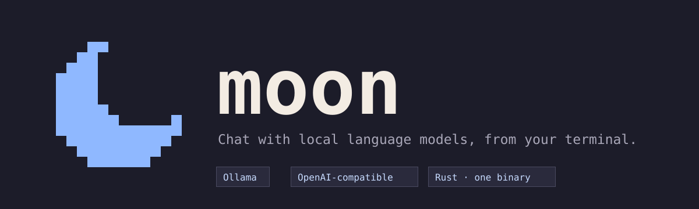
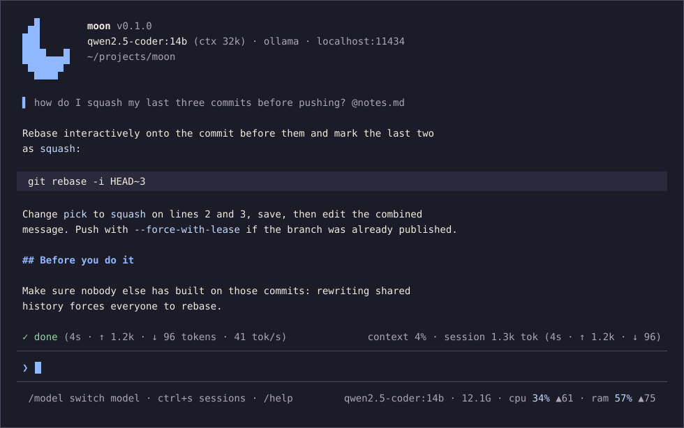

<p align="center">
  
</p>

<p align="center">
  <a href="#install"></a>
  <a href="LICENSE"></a>
  
  
</p>

<p align="center">
  A fast, keyboard-first chat client for language models that run on your own machine.<br>
  Ollama out of the box, any OpenAI-compatible server next to it, a model that can act on your project on your terms, and the state of your hardware always in view.
</p>

<p align="center">
  
</p>

## Install

One binary, nothing else to install. macOS, Linux and Windows.

**Linux / macOS**

```sh
curl -fsSL https://raw.githubusercontent.com/towerforge/moon/main/install.sh | sh
```

**Windows** (PowerShell)

```powershell
irm https://raw.githubusercontent.com/towerforge/moon/main/install.ps1 | iex
```

Then, with [Ollama](https://ollama.com) running and a model pulled:

```sh
ollama pull qwen2.5-coder:14b
moon
```

That is all: with no configuration moon finds Ollama at `http://localhost:11434` (or wherever `OLLAMA_HOST` points) and picks the first model it sees. Type a question, press `Enter`; `/help` lists everything else.

<details>
<summary><b>What the installers do, manual download, from source, updating</b></summary>

**The installers.** `install.sh` detects your OS and architecture, verifies the SHA-256 and installs to `/usr/local/bin` as root, otherwise to `~/.local/bin`. `MOON_INSTALL_DIR`, `MOON_VERSION`, `MOON_VARIANT=musl|gnu` and `MOON_FORCE=1` change where, which version, which Linux binary and whether to install over an existing one. `install.ps1` installs `moon.exe` to `%LOCALAPPDATA%\Programs\moon`, verifies its SHA-256 and adds it to your user `PATH`; the same `MOON_INSTALL_DIR`, `MOON_VERSION` and `MOON_FORCE` apply, as `$env:` variables. The Windows build is recent and has had less testing: use Windows Terminal or another terminal with ANSI support, and open an issue if something misbehaves.

**Manual download.** Binaries are on the [releases page](https://github.com/towerforge/moon/releases/latest), with `checksums.txt` next to them:

| Platform | Asset |
|---|---|
| Linux x86_64 · ARM64 (glibc) | `moon-linux-x86_64.tar.gz` · `moon-linux-aarch64.tar.gz` |
| Linux x86_64 · ARM64 (static) | `moon-linux-x86_64-musl.tar.gz` · `moon-linux-aarch64-musl.tar.gz` |
| macOS Intel · Apple Silicon | `moon-macos-x86_64.tar.gz` · `moon-macos-aarch64.tar.gz` |
| Windows x86_64 | `moon-windows-x86_64.zip` |

**From source** (Rust 1.88 or newer): `cargo install --git https://github.com/towerforge/moon moon-cli`, or `make install` in a checkout.

**Updating.** The installers do the first install and step aside; from then on:

```sh
moon update          # what the new release brings, and it installs it once you say yes
moon update --check  # says what there is and installs nothing
```

It downloads the release for your platform, checks its SHA-256 and swaps the binary in place. `-y` skips the question, `--to 0.2.0` picks a version, `--force` reinstalls. It leaves a binary from `cargo install` or a local build alone, and says so; `sudo moon update` where you cannot write. With `update_check = true` in the configuration moon asks GitHub once a day and says at startup when there is something newer.

</details>

## Features

- **Local first.** Talks to Ollama over its native API, so it knows what only Ollama can tell: context windows, quantization, which model is in memory and how much it takes. Any OpenAI-compatible server (LM Studio, llama.cpp, vLLM, OpenRouter…) plugs in with three lines of configuration.
- **A real chat interface.** Streaming Markdown with syntax-highlighted code, a status line that shows what the model is doing, tokens sent and received, speed, and how much of the context window the conversation fills.
- **Your files in the context.** Attach a file or a line range with `@path`, keep files attached for the whole conversation from the files panel (`Ctrl+F`), and put a `MOON.md` in a project so the model knows what it is looking at.
- **Agents: a model that acts, on your terms.** An agent is one file with a prompt and its permissions: the model may read and edit files and run commands from a fixed list — `git diff`, `cargo check`, `docker compose up`, `curl`… — each one `off`, `ask` or `allow`. Never through a shell, never above the directory you started in, and an edit is a diff you approve unless you say otherwise. `/agent` picks, creates and edits them without leaving moon.
- **Sessions that survive.** Every conversation is saved as JSONL. Resume the last one, pick any from a list, rename, delete, export to Markdown.
- **Switch models mid-conversation.** A fuzzy list grouped by provider, with your recent models on top. The history stays; the next question goes to the new model.
- **The machine, always in view.** CPU, RAM and GPU memory in the corner, with the peak of the last three minutes, and the loaded model's footprint next to it. When a model spills to the CPU or to swap, you see it before you feel it.
- **Scriptable.** `moon ask` streams a reply to stdout, reads the prompt from a pipe, and keeps everything else on stderr.
- **Fast, small, private.** One Rust binary. No telemetry, no network traffic except to the providers you configure: `moon update` goes to GitHub when you run it, and the start-up check stays off until you turn it on.

## Using moon

From top to bottom: a header with the version, the model and the directory you started in; the conversation; a status line with what the model is doing and how much of the context window is used; the input box; and a row of hints with the agent, the model and the machine:

```
⏵⏵ default · Read · 2 commands   /agent agents · /model switch model   qwen2.5-coder:14b · 12.1G · cpu 34% ▲61 · ram 57% ▲75
```

Every list — models, sessions, files, agents and their permissions, the help — unfolds as a panel under the conversation, in the input box's place: `↑↓` move, the number of a row jumps to it, `Enter` picks, `Esc` closes. Nothing floats over what you are reading. `/machine` draws the CPU, RAM and GPU readings over the last three minutes. The whole screen, row by row, is in [docs/interface.md](docs/interface.md).

### Commands

Type `/` and the commands that match appear over the box: `↑↓` move, `Tab` completes, `Enter` runs the highlighted one.

| Command | What it does |
|---|---|
| `/model` | switch model: opens the list to pick one (also `Ctrl+P`) |
| `/provider [id]` | provider status, or set the default provider for bare model names |
| `/agent` | who talks to the model and what it may do: pick an agent, `Ctrl+T` its permissions, `Ctrl+E` its prompt, `Ctrl+A`/`Ctrl+R`/`Ctrl+D` create, rename, delete |
| `/tools` | an alias kept for a while: the permissions of the agent in use |
| `/files` | attached files: see what they cost, detach them and add more (also `Ctrl+F`) |
| `/context` | what the model sees: context file, attached files, agent and permissions, token budget |
| `/sessions` | resume a saved conversation (also `Ctrl+S`); `Ctrl+R` renames, `Ctrl+D` deletes |
| `/new` · `/clear` | new conversation · clear the view without closing the conversation |
| `/save [name]` · `/export [path.md]` | rename the conversation · write it as Markdown |
| `/retry` · `/undo` · `/copy` | regenerate the last reply · remove the last exchange · copy the last reply |
| `/system [text]` | show or set the system prompt |
| `/params key=value …` | generation parameters: `temperature`, `num_ctx`, `top_p`, `max_tokens`, `think`, `stop` |
| `/machine` | cpu, ram, gpu and swap drawn over the last 3 minutes |
| `/help` · `/quit` | commands and keys, in a scrollable panel · quit |

### Keys

| Key | Action |
|---|---|
| `Enter` | send |
| `Ctrl+J` · `Alt+Enter` · `Shift+Enter` | newline (`Shift+Enter` only with the kitty keyboard protocol) |
| `Esc` | cancel the generation · close the panel · clear the selection |
| `Ctrl+C` | cancel; twice with an empty input, quit |
| `Ctrl+P` · `Ctrl+S` · `Ctrl+F` | the models, sessions and files panels |
| `1`…`9` · `12` · `Alt+1`…`Alt+9` | in a list, go to the row with that number and open it; past the ninth it takes two digits, or `Enter` to settle for the row you are on; while you are typing a filter the digits belong to it, `Alt` always jumps |
| `Ctrl+R` · `Ctrl+D` | in the sessions and agents panels: rename · delete the highlighted one (`Ctrl+D` with an empty input and no panel quits) |
| `Ctrl+A` · `Ctrl+T` · `Ctrl+E` | in the agents panel: new agent · its permissions · its description and prompt |
| `↑↓` · `Enter` · `←→` · `Esc` | in the permissions panel: move · open a group, or a row on and off · a whole group off or on, or `off` · `ask` · `allow` on a row · back to the groups, then close |
| `1` · `2` · `↑↓` · `Enter` · `Esc` | in the approval panel: yes · no · choose · confirm · cancel the turn; `PgUp` · `PgDn` scroll the diff |
| `↑` · `↓` | prompt history (on the first / last line of the input) |
| `PgUp` · `PgDn` · `Ctrl+↑` · `Ctrl+↓` | scroll the conversation |
| `Ctrl+End` · `Ctrl+Home` | jump to bottom (and follow the reply) · to top |
| `Tab` | complete a command, or a path after `@` |
| `Ctrl+W` · `Ctrl+U` · `Ctrl+K` | delete word · to line start · to line end |
| `Ctrl+A` · `Ctrl+E` | start · end of line (in the input box) |

The mouse works too: the wheel scrolls, dragging over the conversation selects text and copies it when you let go, and the «↓ Jump to bottom» pill is clickable. In the input box a click moves the cursor and a drag selects what you are writing. To select text with your terminal instead, hold `Shift` while dragging, or set `mouse = false`.

### Files in the context

The model only sees what you give it: `@path` or `@path:40-120` in a message attaches a file as it is now; `Ctrl+F` keeps files attached for the whole conversation and shows what each one costs; a `MOON.md` in the directory you start from goes into every system prompt. moon warns instead of sending when the attachments would pass 80 % of the context window, and refuses binaries and files that look like credentials (`@!path` forces one through).

## Agents: letting the model act

Off until you turn it on. Everything the model does goes through an **agent**, and an agent is **one TOML file** in `~/.config/moon/agents/` with a prompt and its permissions, whole: **choosing the agent is choosing what the model may do**. There is no other switch and no other place to look.

`moon config init` writes two: `default.toml`, the agent every conversation starts with (reading on, nothing else), and `reviewer.toml`, a sample that reads the project and looks at git and never writes. Any other file in the folder is an agent of yours — and you do not have to write it by hand:

- `/agent` is a picker like `/model`'s: `Enter` picks the agent for the conversation, `Ctrl+A` creates one (name it, and moon writes a template and opens its permissions), `Ctrl+R` renames it, `Ctrl+D` deletes it.
- `Ctrl+T` opens its **permissions**: the groups (**Editor**, **Files**, **Git**, **Stack**, **Docker**, **Network**), then one row per capability, each **off** (not offered), **ask** (shown to you first: the diff, or the command line) or **allow** (runs on its own). Every step is saved to the file at once.
- `Ctrl+E` opens its **description and prompt**, edited in moon itself. No prompt means moon's own.

```
 Permissions · committer › Git                    agents/committer.toml
   git status   ◀  off  ▶  what is changed, staged and untracked
 ❯ git diff     ◀ allow ▶  the changes not yet committed
   git commit   ◀  ask  ▶  commit what is staged
```

The files are yours: edit one by hand and the next message uses it. Each lists every capability there is, `off` included, with what it does as a comment, and when an update adds capabilities every file is brought up to date on the next start. `moon config reset` writes `config.toml`, `default.toml` and `reviewer.toml` again as they ship; your other agents and your sessions stay. Because a file grants, the agents folder carries the same trust as `config.toml`: only ever your own configuration.

What keeps it safe: commands run as programs with their arguments, never through a shell, and only from a fixed list; paths stay under the directory you started in, `.git/` and anything that looks like a secret are never touched; edits and new files ask by default, and `allow` on them — writing without showing you the diff — is yours to set. The full catalogue, the rules and what they cannot protect you from are in [docs/tools.md](docs/tools.md); the design in [docs/agents.md](docs/agents.md) and [docs/harness.md](docs/harness.md).

## Sessions and the CLI

Conversations are saved as JSONL and titled after the first message. `Ctrl+S` opens them: `Enter` resumes, `Ctrl+R` renames, `Ctrl+D` deletes. `moon --resume` continues the last one.

```sh
moon ask "explain the borrow checker"          # reply streams to stdout
git diff | moon ask --system "review this"     # prompt from stdin
moon ask "summarize @README.md"                # the same @path mentions as the TUI
moon -m ollama/qwen2.5-coder:14b               # start with this model
moon --resume                                  # continue the last conversation
moon models · moon providers · moon sessions list
moon config init | reset | path | show         # the files: write what is missing, start over, where, in effect
moon update · moon update --check
```

`moon ask` gets no agent and no tools: there is nowhere to approve. More in [docs/interface.md](docs/interface.md#the-cli).

## Configuration

Everything is optional; without a file moon talks to Ollama on `localhost` and uses the first model it finds. `moon config init` writes the commented `config.toml` in `~/.config/moon/` and, next to it, the `agents/` folder.

```toml
[general]
default_model = "ollama/qwen2.5-coder:14b"
system_prompt = "Answer briefly."

[params]
num_ctx = 16384          # the window Ollama loads the model with

[providers.lmstudio]     # any OpenAI-compatible server
type     = "openai"
base_url = "http://localhost:1234/v1"
```

| What | Where |
|---|---|
| Configuration | `~/.config/moon/config.toml` |
| Agents, `default` included | `~/.config/moon/agents/<name>.toml` |
| Sessions | `~/.local/share/moon/sessions/` |
| Log and recent lists | `~/.local/state/moon/` |

Every key, the providers, the theme and the log are in [docs/configuration.md](docs/configuration.md).

## FAQ

**Does moon edit files or run commands?** Only what the agent in use allows, and never through a shell. Off by default. See [Agents](#agents-letting-the-model-act).

**I want to start from scratch.** `moon config reset` writes the configuration and the two factory agents again, after asking; your own agents and your sessions stay. To wipe everything, delete `~/.config/moon/`, `~/.local/share/moon/` and `~/.local/state/moon/`.

**`Shift+Enter` sends instead of inserting a newline.** Terminals only distinguish `Shift+Enter` from `Enter` with the kitty keyboard protocol (kitty, WezTerm, Ghostty, foot). Everywhere else use `Ctrl+J` or `Alt+Enter`.

**The colors look flat.** Your terminal did not announce truecolor, so moon falls back to the 256-color palette. Set `COLORTERM=truecolor` if the terminal really supports it. Terminal.app on macOS does not.

**The wheel changes my prompt instead of scrolling.** That happens with `mouse = false`: in the alternate screen the terminal turns wheel events into arrow keys. Leave mouse capture on and hold `Shift` when you want the terminal's own text selection.

**Where does the model size come from?** From Ollama's `/api/ps`: the loaded footprint, how much of it sits in the GPU, the context length and when it will be unloaded. Other providers do not expose this.

**Which Ollama version do I need?** Any recent one. moon is developed against 0.34.

## Development

```sh
make check              # fmt --check + clippy -D warnings + tests, what CI runs
make run ARGS="ask hi"  # run from source
make build              # release binary in target/release/moon
make help               # everything else: cross-compiling, versioning, releasing
```

A Cargo workspace of seven crates:

| Crate | Role |
|---|---|
| `moon-core` | the `Provider` trait, domain types, configuration, XDG paths, JSONL sessions, files in the context |
| `moon-provider-ollama` | Ollama over its native API |
| `moon-provider-openai` | any OpenAI-compatible chat completions API |
| `moon-agent` | the model acting on the project: the loop, the agents and their files, the catalogue of what it may do, the tools and the sandbox; [docs/harness.md](docs/harness.md) and [docs/agents.md](docs/agents.md) are the designs |
| `moon-tui` | the interface: `app/` is the state, Elm style, one module per concern; `view/` paints it |
| `moon-updater` | the GitHub releases, the checksum and the swap of the binary behind `moon update` |
| `moon-cli` | the `moon` binary |

Adding a provider is a new crate that implements `Provider` and `ProviderFactory`, plus one line in `crates/cli/src/main.rs`. Adding a command the model may run is one `Entry` in `crates/agent/src/tools/catalog.rs`; `UPDATE_DOCS=1 cargo test -p moon-agent docs` then refreshes its table in [docs/tools.md](docs/tools.md), and every agent file picks it up at the next start. Rendering is tested on ratatui's `TestBackend`, providers on `wiremock`. See [CONTRIBUTING.md](CONTRIBUTING.md) for conventions and the release flow.

## Contributing

Bug reports, provider integrations and rough edges made smooth are all welcome. Read [CONTRIBUTING.md](CONTRIBUTING.md), open a pull request against `dev`, and make sure `make check` is green.

## License

[MIT](LICENSE)

<p align="center">
  <br>
  
</p>
